# Reproduction: *Path Integral Methods with Stochastic Control Barrier Functions*

<p align="center">
  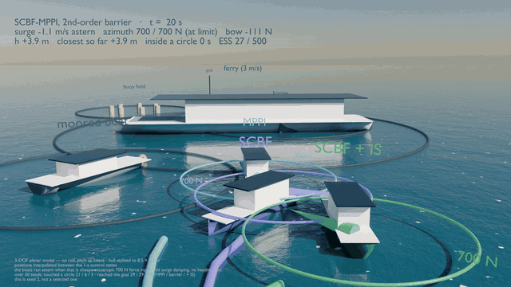
</p>

<p align="center">
  <sub>
  <b>MPPI</b> &middot; <b>SCBF-MPPI</b> &middot; <b>SCBF-MPPI + IS</b> meeting a ferry crossing at 3 m/s.
  Each ring is that boat's 700&nbsp;N azimuth thrust limit; the readout is its live state.<br>
  Nothing here is an illustration &mdash; every frame is the stored 1&nbsp;s state log of a run in
  <code>results/</code>, drawn by a planar model, so no roll and no pitch.
  </sub>
</p>

<p align="center">
  <a href="https://arxiv.org/abs/2206.11985"></a>
  
  
  
  
</p>

---

Tao, Yoon, Kim, Hovakimyan, Voulgaris — arXiv:2206.11985 (June 2022); IEEE CDC 2022, pp. 1654–1659.

This package re-implements the paper's Algorithm 1 (SCBF-MPPI) and its baseline (MPPI) on the paper's own
example — a unicycle with additive Brownian noise in a sinusoidal corridor — and turns an independent,
referee-style review of the paper's claims into experiments. Everything is plain Python: NumPy for the vectorised rollouts,
SciPy for quantiles, cvxpy + Clarabel for the exact per-sample SDP/SOCP (validation and wall-clock only),
matplotlib for figures and the animation. One command per figure; every number reported below comes from
`results/*.json`.

```
pip install -r requirements.txt
python -m scbf_mppi.selftest                          # ~5 s: solver vs cvxpy, bridge crossing law, Theorem 2, one episode each
python -m scbf_mppi.experiments --exp all --runs 10   # ~25 min on two cores; writes results/*.json
python -m scbf_mppi.figures                           # writes figures/*.png and results/E*_summary.txt
python -m scbf_mppi.animate                           # figures/anim_mppi_vs_scbf.mp4 and .gif (needs ffmpeg for the mp4)
python -c "from scbf_mppi import scbf; print(scbf.validate_against_cvxpy(200, form='std', z=2.748))"
```

The shipped `results/*.json` were produced with these exact calls — about an hour on two cores:

```
python -m scbf_mppi.experiments --exp E1,E8,E11,E14 --runs 30   # 30 seeds per setting
python -m scbf_mppi.experiments --exp E2 --runs 30              # E2 uses runs/2 = 15 seeds per σ
python -m scbf_mppi.experiments --exp E12,E13 --runs 10         # E13: 10 seeds; E12 uses max(5, runs/2) = 5
python -m scbf_mppi.experiments --exp E3,E4,E6,E9               # deterministic / timing — no seeds
```

## What is implemented, and from where in the paper

| Element | Where | Implementation |
|---|---|---|
| Dynamics | Sec. V-A: unicycle, `σ dW` with σ = I₃, Δt = 0.05 | `dynamics.py`, Euler–Maruyama; nominal (noise-free) model for the rollouts, as in eq. (9) |
| Safe set, barriers | Sec. V-B: C = {sin(πx/2) < y < sin(πx/2)+1}; printed h uses sin x | `env.py` — `Corridor(printed=False)` uses the set as defined; `printed=True` the barriers as printed |
| Cost | Sec. V-B: q = ‖X−X_g‖² + 1000·1[X∉C]; λ = 1; T = 20 | `mppi.py`; terminal φ = ‖X_T−X_g‖² (**not stated — assumption**) |
| MPPI | Sec. III-B, eq. (4), q̃ with ν = 1, R = λΣ₀⁻¹ | `MPPI` |
| SCBF chance constraint | eq. (5); Theorem 2 / eq. (6),(8) | `scbf.solve_rows` — `form="variance"` is the constraint **as printed**, `form="std"` the chance constraint it claims |
| Per-sample problem (7)/(8) | objective ‖μ−μ₀‖₁ + ‖P−P₀‖_F | closed-form one-dimensional solve (exact up to grid resolution because the ω column of L_g h is zero; validated against cvxpy in `scbf.validate_against_cvxpy`) |
| Algorithm 1 | Sec. III-C | `SCBFMPPI` (per sample, per timestep) with modes `both`, `mean_only`, `var_only`, optional importance-sampling correction |
| Deterministic MPPI | Homburger, Messerer, Diehl, Reuter, L-CSS 2025, Alg. 1 | `DeterministicMPPI` (β = ν^j, λ ← β²λ₀, Σ ← β²Σ₀, correction λWᵀΣ⁻¹U) |
| Metrics | Sec. V-C: collision rate = fraction of states outside C; TTF; goal radius 0.15; ≤ 250 steps | `simulate.py` — plus activation fraction, realised Var[δv]/Var₀, delivered Pr(Au ≥ b), ESS, min h, between-sample excursions (Brownian bridge) |

## What the paper does not state, and what was assumed

* **Σ₀, the sampling covariance of the perturbations.** Not reported. `sigma_v = 1.0, sigma_om = 1.5` were chosen because at that
  setting plain MPPI reproduces Table I (collision rate ≈ 0.05, TTF ≈ 130 steps at K = 500). See E1.
* **The process-noise level.** The paper says σ is the identity. At σ = I₃ and Δt = 0.05 every controller — and a robot with no
  control at all — leaves the corridor (E2). Table I is only reproducible at σ ≈ 0.1. All main experiments use σ = 0.1 and say so.
* **α in eq. (6)** is "the confidence interval corresponding to 1−δ": taken as the one-sided quantile z = Φ⁻¹(0.997) = 2.748
  (the paper's 1−γ = 0.997); `alpha=3` is also run (E11).
* **Terminal cost** φ: not given; ‖X_T − X_g‖².
* **The class-K function** in the SCBF condition is the identity (eq. (3): "≥ −h").
* **Input bounds**: none in the paper; none by default (`u_max` available; E11 runs one bounded case).
* **The SDP norm p** in (7)/(8): Frobenius.

## The experiments

| | Question | Result file / figure |
|---|---|---|
| E1 | Does Table I / Fig. 1 reproduce? With the constraint as printed and as corrected? | `E1_table1.json`, `fig_E1_*.png` |
| E2 | Is the stated noise σ = I compatible with Table I? | `E2_sigma_sweep.json`, `fig_E2_sigma.png` |
| E3 | What does Algorithm 1 cost in seconds? (10,000 SDPs per cycle) | `E3_wallclock.json`, `fig_E3_wallclock.png` |
| E4 | What probability does the printed constraint actually deliver? (Theorem 2, variance vs std) | `E4_theorem2.json`, `fig_E4_theorem2.png` |
| E5 | Braking or steering? |v| and |ω| against distance to the wall | `fig_E5_braking.png` |
| E6 | Can Table II (N₁, N₂) be evaluated from measured quantities? | `E6_samplecount.json` |
| E7 | Do zero collisions at sample times mean the path stayed inside? | `fig_E7_bridge.png` |
| E8 | Which mechanism produces the safety — the mean shift, the variance reduction, or both? Against deterministic MPPI at equal rollouts | `E8_mechanisms.json`, `fig_E8_mechanisms.png` |
| E9 | Theorem 1 (Clark 2021) — the So–Clark–Fan counterexample, simulated | `E9_clark.json`, `fig_E9_clark.png` |
| E11 | The corrected constraint at other confidence levels — the exploration/safety trade-off | `E11_delta_sweep.json`, `fig_E11_delta.png` |
| E12 | The printed barriers put the goal outside the safe set | `E12_printed_barriers.json`, `fig_E12_printed.png` |
| E13 | Deterministic MPPI: is the E8 comparison sensitive to the annealing schedule (ν, iterations × samples)? | `E13_det_sensitivity.json` |
| E14 | With input bounds (|v| ≤ 2, |ω| ≤ 4) — does the ranking of MPPI / SCBF-MPPI / + IS correction change? | `E14_bounded.json` |

Seeds are fixed (`seed = 0 … runs−1`); rerunning with the calls above reproduces the JSON files exactly on the same platform. Confidence intervals in the figures are 2000-resample bootstrap intervals over seeds.

## On the water — the method transferred to the ISD research vessel Solgenia (`scbf_mppi/vessel/`)

The second study applies the same three controllers to the group's own vessel, using its published model unchanged:
Homburger, Wirtensohn, Hoher, Baur, Griesser, Diehl, Reuter, *Solgenia — A Test Vessel Toward Energy-Efficient Autonomous
Water Taxi Applications*, Ocean Engineering 2025 (arXiv:2502.01207), Table A.5, and the MATLAB files in
`github.com/hhomb/Solgenia` (`ShipModel.m`, `PropModel.m`, `ParametersSolgenia.m`). `vessel/solgenia.py` is a line-by-line
vectorised port; `python -m scbf_mppi.vessel.selftest` checks its drift against the MATLAB `f(x, u)` at 200 random states (agreement
to 10⁻¹⁵) and reports the one abstraction the port makes — the thrust is held over an integration step instead of being
re-evaluated at every RK4 stage — as a 2 mm difference over the 10 s of `MinimumExample.m`.

```
python -m scbf_mppi.vessel.selftest                       # ~10 s: model vs MATLAB, barrier rows vs finite differences,
                                                          #        L_g h = 0, Itô term, solver vs cvxpy, delivered probability
python -m scbf_mppi.vessel.experiments --exp all --runs 30 # ~2.5 h on two cores; writes results/vessel_V*.json
python -m scbf_mppi.vessel.figures                        # figures/fig_V*.png, results/vessel_summary.txt
python -m scbf_mppi.vessel.animate                        # figures/anim_vessel_mppi_vs_scbf.mp4 / .gif
```

| Element | Choice | Where |
|---|---|---|
| Vessel | 3-DOF Fossen-type model, all 27 dynamic + 12 thruster parameters from Table A.5 / `ParametersSolgenia.m` (repository rounding) | `vessel/solgenia.py` |
| Input | u = (X_AT, Y_AT, F_BT) [N]: azimuth thrust resolved in the body frame + bow thrust, so τ = Bu is linear (the method needs input-affine dynamics; n\|n\| laws and an azimuth angle are not). Azimuth thrust in the 700 N disk (n ≤ 2000/60 Hz, c_AT = 0.63, d_AT = 0); bow thrust ≤ 244 N·e^(−0.62u²) | `solgenia.clip_inputs` |
| Integration | RK4 at 0.25 s (the group's `RK4_step.m`), four sub-steps per 1 s control interval; additive force noise by Euler–Maruyama per sub-step | `solgenia.step` |
| Neglected | actuator time constants (0.1–0.3 s) and rate limits; roll/pitch/heave (as the group does) | — |
| Scenario | start (0, 0) heading east at 1.5 m/s, goal (120, 0), goal radius 5 m; three moored obstacles (inflated radii 12, 14, 11 m = obstacle + 5 m ego radius); the crossing scenario adds the group's Experiment-III ferry: R = 25 m, 3 m/s northbound, on the track at x = 66 m at t = 22 s | `vessel/harbour.py` |
| Barrier | h_j = ‖p − c_j(t)‖ − R_j (their circle scheme). As printed the row is 0 ≥ b (L_g h = 0). Second-order: ψ₁ = ḣ + α₁h, ψ̇₁ + α₂ψ₁ ≥ 0 ⇔ a·τ ≥ b; α₁ = 0.1 s⁻¹, α₂ = 0.4 s⁻¹ (sweep in V6). Itô term computed in general (`ito_term`); zero for velocity noise | `harbour.rows`, `harbour.rows_printed` |
| Per-sample problem (8) in 3 inputs | one active row: closed form, exact (rank-one shrink of P along the row — Frobenius-minimal — plus the ℓ₁-cheapest mean shift, on the largest coefficient; the std form has the closed-form optimum s* = clip(slack/z, 0, ‖w‖)); m ≥ 2 active rows: a near-optimal heuristic — candidate target stds per row, the factor update Δ = Aᵀ(AAᵀ)⁻¹Vᵀ (Frobenius-minimal among row-wise shrinks, not the global minimiser), and the exact ℓ₁ mean shift over all rows by LP vertex enumeration. Always feasible; V0 measures the objective gap to the exact SOCP on real instances, split by the number of active rows (one row: ~10⁻⁷; two rows: median ≈ 8 %, p90 ≈ 40 % more conservative) | `vessel/solver_nd.py` |
| Controllers | `VesselMPPI`, `VesselSCBFMPPI` (modes `hocbf`, `printed_rd1`; forms `std`, `variance`; optional IS correction), `VesselDetMPPI` (L-CSS 2025 Alg. 1) — same weight and update equations as the corridor code | `vessel/controllers.py` |
| Cost | q = ‖p − p_g‖² + 2000·max(0, \|u\| − 2.5)² + 20000·1[min_j h_j < 0], φ = ‖p_T − p_g‖²; K = 500, T = 15 (15 s, the group's NMPC horizon), λ = 300 m², Σ₀ = diag(350², 350², 120²) N² (MPPI reaches the goal in every seed at about 2 m/s, collision rate ≈ 0.02 under the default disturbance) | `vessel/controllers.py` |
| Disturbance | environmental force with stationary std s_F = (120 N, 300 N, 400 N m) and correlation time τ_c = 5 s, three ways with equal spectral density at zero: `white` (intensity s_F√(2τ_c) — the paper's model), `ou` (Ornstein–Uhlenbeck gust), `ou` + 0.5 m/s cross-current unknown to the controller | `vessel/simulate.py` |
| Metrics | collision rate = fraction of 0.25 s integration steps inside a circle (`collision_rate_ctrl`: at the 1 s control instants only), runs touching, time to goal (150 s = not reached), min h over the integration steps, ESS (mean, median, and mean inside the obstacle field x < 100 m), activation (any row), Var kept along the most violated row, delivered Pr(all rows a·u ≥ b) on active pairs after clipping, fraction of draws clipped by the thrust limit, fraction with ≥ 2 active rows | `vessel/simulate.py` |

| | Question | File |
|---|---|---|
| V0 | Solver fidelity on 300 real per-sample instances vs the exact SOCP; SDP time per problem | `vessel_V0_solver.json` |
| V1 | As printed (relative degree 1): identical to MPPI? | `vessel_V1_printed.json`, `fig_V1_printed.png` |
| V2 | Harbour transit, white noise: MPPI K = 500 / 2000, SCBF (2nd-order), + IS, variance form, deterministic MPPI | `vessel_V2_harbour.json`, `fig_V2_*.png` |
| V3 | Disturbance model: white vs 5 s gust vs gust + unknown current | `vessel_V3_disturbance.json`, `fig_V3_disturbance.png` |
| V4 | Crossing ferry | `vessel_V4_crossing.json`, `fig_V4_crossing*.png` |
| V5 | Wall-clock per cycle | `vessel_V5_wallclock.json`, `fig_V5_wallclock.png` |
| V6 | Barrier gains α₁, α₂ | `vessel_V6_gains.json`, `fig_V6_gains.png` |
| V7 | Confidence level δ | `vessel_V7_delta.json`, `fig_V7_delta.png` |
| V8 | Deterministic MPPI (the group's method): λ₀, ν and schedule sweep | `vessel_V8_det_sweep.json`, `fig_V8_det.png` |

Shipped results: 30 seeds (V2, V3, V4), 20 seeds (V6, V7, V8), 10 (V1); `results/vessel_summary.txt` lists every number.

Two things to read with the numbers. In the obstacle field the effective sample size of every sampling controller is small (MPPI ≈ 5 of 500; the 20,000 m² collision penalty with λ = 300 m² makes colliding samples negligible and the remaining weights are still peaked) — this is the weight degeneracy in clutter the paper starts from, and it means the controllers here are close to best-of-K selection; raising λ flattens the weights but lets colliding samples into the average. And the importance-sampling correction's density uses log|det P| of the actual per-sample factor (slogdet), which is exact for the rank-one and for the multi-row update alike; a collapsed direction (singular P) is floored at det P₀·10⁻⁶, which gives such a sample a negligible weight — a convention inherited from the corridor code.

An independent line-by-line review of this package (model port, barrier algebra, solver, controllers, disturbance models, metrics, experiment configurations) was carried out before the final runs; every finding was fixed and the experiments re-run with the corrected code.
`python -m scbf_mppi.vessel.experiments --exp all --runs 30` reproduces them exactly on the same platform.

### Live demo

`live_demo/safety_bench.html` is a single-file browser page (no installation) with both scenes and all controllers. Modes: a
single run, or a *race* of two to four controllers on the same seed — every controller's plant is driven by its own copy of the same
random stream, so the disturbance realisation is identical (common random numbers) and a live leaderboard ranks them by collision
steps, then time to goal. Sliders: K, noise, 1−δ, seed, playback speed. Drawn every cycle: 60 of the K sampled rollouts, opacity by
weight, amber on the segments where the barrier chance constraint binds for the proposal; on the vessel the front ψ₁ = dh/dt + α₁h = 0 of the
second-order barrier at the boat's current velocity (d(θ) = R − |v_rel| cos(θ − θ_v)/α₁, clipped at R — inside it the barrier row
forces recovery); the wake; the last four finished runs as ghosts; a replay scrubber over the recorded frames (fan snapshots with
their binding flags, states and counters, so the stats and the leaderboard follow the scrubber); a sample inspector (hover a rollout:
its weight and the steps on which the constraint bound); pause on collision; a 20-seed batch.

**Added 13 September.** (1) *Unknown current and gust*: the disturbance model (white / OU gust / none) and a constant current
(speed, eight directions) that enters the plant kinematics only — the controller's rollouts and barrier rows never see it (experiment
V3); the water drifts on screen, the gust force is drawn on the hull, and the dotted front shows the true ψ₁ = 0 locus next to the
dashed believed one. (2) *Inside this cycle*: for the row the filter works on at t = 0 of each plan — all K samples share x₀ and the
nominal ū there — the distribution of a·u along the row's normal, drawn in units of the nominal spread σ₀ = √(aᵀΣ₀a) on one
fixed, gently eased axis (so the picture glides between cycles instead of re-scaling): b at zero, the nominal proposal a unit
Gaussian at (a·ū − b)/σ₀, the filtered one N((a·(ū+μ) − b)/σ₀, |Pᵀa|²/σ₀²) solid (a point mass when the solver collapsed the row —
it then sits exactly on b), the mass left of b, the two margins as ticks (z·σ corrected at the constant z; α·σ² as printed at α·σ₀ —
α = z, so their ratio is σ₀ in the row's units, ≈ 0.1 on the vessel and 1.2–1.6 on the corridor), the delivered probabilities before
input clipping, a status chip, and a strip with the share of samples on which a row binds at each horizon step. The shown row is
kept with hysteresis (it switches only when another row is tighter by more than 0.75 σ₀), and the parameters ease over the first
third of each control interval; the thrust needles and the new rollout fan ease the same way. The probabilities were checked against Monte Carlo through the recorded
(μ, P) (40 000 draws, agreement to 0.002). The shown row is the one the solver acted on (the most violated by nominal margin), else the most violated by nominal
z-score; for deterministic MPPI it is recorded from the first of its four iterations. (3) *Thrust gauges*: the applied azimuth vector
inside the 700 N disk, the raw (unclipped) request when it exceeded the disk, the bow thruster against its cap F_BT ≤ 244·e^(−0.62u²),
and the share of draws clipped this cycle; the dial is drawn bow-up with the model's +y sway to the left (the map is an east–north
plane, a mirror of the NED convention the symmetric hull permits, so the page does not say port or starboard). (4) *Camera follow*
at 2× with the hull at true scale. (5) *Story mode*: a scripted run (crossing scene, seed 26, MPPI / SCBF-MPPI / + IS / det. MPPI, white
noise) with captions — at t ≈ 39 s the deterministic MPPI touches the barge circle, the run pauses, rewinds five seconds with its heaviest rollout
highlighted and continues, six seconds later MPPI touches it as well, the two barrier variants stay clean; the end card states the 30-seed context of that scene (MPPI touches in 18, SCBF-MPPI in 8, + IS in 2, det. MPPI in 23;
`story_scan.json`, a scan of this core in Node — a browser's own sin/cos/pow differ in the last bit, so a single seed can end differently there; seed 26 was chosen because its outcome survives 10⁻⁹ perturbations of the initial state in six replicas). Two more animations from the Python package: `python -m scbf_mppi.vessel.animate_current`
(V3 seed 0, gust + 0.5 m/s current, three boats; the run reproduces the stored V3 metrics exactly) and
`python -m scbf_mppi.vessel.animate_rowspace` (map beside the row picture, SCBF-MPPI on the crossing scene, seed 2). None of the
additions changed a trajectory: `node xval_same.js` (against `sim_v3_backup.js`, the core before them) reproduces every path bit for bit.

**Solver port and a background thread (13 September, later).** The vessel solver of the browser core (`solveRows` in `sim.js`) is now a
port of `solver_nd.solve_rows_nd`: one active row exact (std form: shrink to s* = clip(slack/z, 0, s_nom), then the l1-cheapest mean
shift; variance form: the same 65-point grid), and — for two or more rows active at the nominal proposal, or a row violated by the
single-row solution — the package's joint candidate solve (Frobenius-minimal factor update Δ = Aᵀ(AAᵀ)⁺Vᵀ over the candidate target
stds {0, f*, 1, f*/2} per row with the local refinement, exact l1-minimal mean shift over ALL rows by LP vertex enumeration). On
3 200 random instances at the vessel's scale (both forms, 1–4 rows, 2 329 with several active rows; `live_demo/solver_xval/`) it
agrees with the Python solver to 2·10⁻⁷ relative in μ and 10⁻⁹ in P with identical active / multi / infeasible flags, and every
row is satisfied after the solve (worst relative margin −4·10⁻¹³) — the residual violations the earlier sequential sweeps left on
about a third of the multi-row samples are gone, which is what the row view of the crossing scene used to show. MPPI, deterministic
MPPI, the printed rows and the whole corridor are bit-identical to the previous core (`xval_solver.log`, against `sim_v5_backup.js`);
the SCBF trajectories changed, and the 30-seed comparison below and `story_scan.json` were re-run. The page now runs the simulation
in a Web Worker (falling back to the main thread when the page may not create one), one step ahead of the drawing, so the animation
never stalls while 500 rollouts are planned (frame times while racing four controllers: 23 ms mean / 50 ms worst instead of 75 / 217);
the boats are interpolated through the 0.25 s RK4 sub-steps, and the fan, the fronts, the row view and the gauges ease between cycles.
The Step button queues one step per click; the batch runs in the same thread and no longer freezes the tab.

**Added 15 September — the two new results, as instruments.** (1) *SCBF-MPPI + intervention penalty*, a sixth
corridor controller with a **μ slider**. It charges `I = |m| + (σ₀ − s)`, the per-sample problem's own objective
value at its optimum, as an extra running cost: `w_k ∝ exp(−(S_k + μ λ Σ_t I_{k,t})/λ)`. μ = 0 is the corrected
controller and large μ is the selection rule Algorithm 1 reaches by accident, so moving the slider sweeps
continuously between them while the effective sample size on the right-hand panel follows, live. Cross-checked
against the study by `node live_demo/xval_intervention.js` (`xval_intervention.log`): at μ = 0 it reproduces the
corrected controller **to machine precision**, so the penalty does not leak into the baseline, and over 24 seeds
the effective size falls monotonically 280.2 → 258.8 → 197.8 → 143.0 → 68.1 → 6.8 → 2.4 across μ = 0 … 3 while
the median minimum barrier rises from −0.074 to +0.189. (2) *“Can any Gaussian do this?”*, a panel that evaluates
the V17 existence test at whatever state the plan starts from: two bands on a σ axis — what the two walls allow,
`σ ≤ (r − ℓ)/2z`, and where the importance weight has finite variance, `σ > σ₀/√2` — with the gap between them
hatched and the factor printed. It is not rigged to fail: where the corridor runs straight the row coefficient is
small, `r − ℓ = (h₁+h₂)/|a|` opens up and the verdict chip turns green, which is the honest statement, since the
obstruction is a property of the state. (3) A sixth controller, *SCBF-MPPI + ESS budget*, with a target-fraction slider: it solves the per-sample
problem subject to the budget of `scbf_mppi/ess_budget.py`, so the weight second moment is held at κ per
step by construction, and it is the only filtered controller here whose importance weights are always
applied — the budget is what makes them exist. `node live_demo/xval_budget.js` (`xval_budget.log`) checks it
against the study: the effective sample size rises monotonically 22.5 → 35.1 → 55.8 → 98.7 across targets of
5, 10, 25 and 50 %, and at the 10 % target the browser's 97-point β grid gives 35.1 against the 512-seed
GPU's 33.7 on the package's 193-point grid. (4) A panel splitting the log density ratio into mean shift, noise and shrink and comparing their spread
across samples — it reports exactly zero total spread for plain MPPI, which is the arithmetic check that
the split is the right one, and shows the shrink term taking the whole of it once the weights are restored.
(5) The *Last runs* table gained an **ESS** column and notes μ on
the rows that used it, so three runs at μ = 0, 0.5 and 3 leave the dial's whole range on screen at once
instead of in the operator's memory. Neither addition changed a trajectory of any existing controller, and
no default changed: the demo still opens on the corridor, single run, plain MPPI, with the new controller
sitting sixth in the list and the new panel below the row view.

The three diagnostics are defined for every controller. The barrier rows are evaluated on every (sample, timestep) pair of every
controller; *constraint active* is the share of pairs on which the nominal proposal (μ = 0, Σ = Σ₀) violates the chance constraint —
for the SCBF variants that is where problem (8) modified the draw, for MPPI and deterministic MPPI it is where it *would* have
(the corrected, standard-deviation form at the chosen 1−δ is used for this test); *Var kept* is the variance left along the active
row, averaged over all pairs (100 % where the constraint is inactive or nothing filters); *delivered* is the fraction of active pairs
on which the actually drawn control satisfies every row — filtered draws for SCBF, unfiltered draws for the others. Deterministic
MPPI reports these and its ESS averaged over its four inner iterations (125 samples each), as the Python package does for the ESS.
For the printed relative-degree-1 rows (a = 0) the class-K gain is Φ⁻¹(1−δ), the V1 setting, so their "binds" share moves with the
chance level while the trajectory stays MPPI's; their *Var kept* reads 100 % in the browser — nothing can shrink along a zero row —
where the package's ratio s/s_nom degenerates to 0/0 and is reported as 0 (a deliberate difference in a diagnostic, not in a trajectory). Adding the diagnostics changed no trajectory: every path the previous core produced
is reproduced bit for bit (`node xval_same.js`, 12 vessel and 10 corridor episodes, `xval_same.log`, `xval_same_v5.log`). The browser batch now counts
collisions and min h at every 0.25 s RK4 sub-step, as the Python package and the live view do.

Its JavaScript core (`live_demo/sim.js`) is a port of this package: on the corridor, 30 seeds in Node give MPPI 0.041 ± 0.011 / 122 steps
(would bind 0.95, delivered 0.480 — Python 0.956 ± 0.015 / 0.485 ± 0.060), SCBF as printed 0.032 ± 0.011 / 183
(activation 0.80, Var kept 0.35, delivered 0.733), corrected 0.065 / 230 (Var kept 0.07, reached 47 %), + IS 0.004 / 117
(reached 100 %), deterministic MPPI 0.054 / 152 — the Python values are 0.046 / 130, 0.045 / 187 (0.81, 0.34, 0.734),
collapse (0.08, 40 %), 0.016 / 114 (100 %), 0.058 / 134 (`xval_corridor_v3.log`). On the moored-obstacle harbour, 30 seeds in Node against
30 in Python (`xval_vessel_v3_30.log`, `results/vessel_V2_harbour.json`): MPPI 0.024 ± 0.018 / 79 s, 33 % of runs touching, ESS 134
vs 0.033 [0.020, 0.047] / 83 s, 57 %, ESS 133; SCBF-MPPI 0.012 ± 0.009 / 97 s, reached 97 %, activation 0.61, Var kept 0.47, delivered 0.906,
ESS 114 vs 0.009 [0.002, 0.018] / 106 s, 0.56, 0.54, 0.909, ESS 129; + IS 0.001 ± 0.002 / 95 s, reached 100 %, delivered 0.952 vs
0.000 / 106 s, 0.956 (`xval_vessel_v6_30.log`, with the ported solver; before it the delivered probabilities were 0.889 / 0.954). Collision rates, activation, variance kept and delivered probabilities agree within the intervals; the
JavaScript SCBF variants reach the goal about 9 % sooner (97 ± 7 s against 106 s), the two cores drawing different random streams. With a
deterministic plant both cores reach the goal in 55–56 s on every seed. Every number reported in this README
comes from the Python package, not from the browser core.
## The simulation videos

Thirteen clips, all in `figures/`, each one drawn from a logged run of this package. None is an
illustration and none is hand-animated. The animations below are the same runs, reduced for the page;
click any still further down to play the full clip.

### The corridor, which is the paper's own example

<p align="center">
  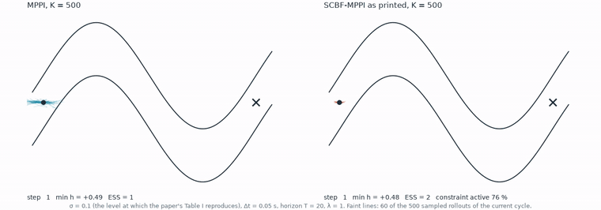
</p>

<p align="center"><sub>MPPI against SCBF-MPPI with the constraint exactly as the paper prints it, on the
same seed. <code>python -m scbf_mppi.animate</code></sub></p>

<p align="center">
  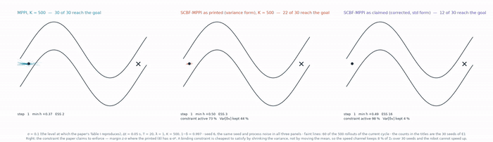
</p>

<p align="center"><sub>The same corridor with the constraint <em>as printed</em> beside the constraint
<em>as claimed</em>. Correcting it is not free: the corrected form shrinks the sampling variance before it
moves the mean, the robot stalls, and 12 of 30 seeds reach the goal against 22 of 30 as printed and 30 of
30 for plain MPPI. <code>python -m scbf_mppi.animate --three</code></sub></p>

### The vessel, which is the method carried to a real hull

<p align="center">
  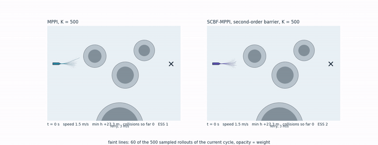
</p>

<p align="center"><sub>MPPI against SCBF-MPPI with the second-order barrier, same seed, crossing ferry.
The fan is 60 of the 500 sampled rollouts of each cycle, shaded by weight.
<code>python -m scbf_mppi.vessel.animate</code></sub></p>

<p align="center">
  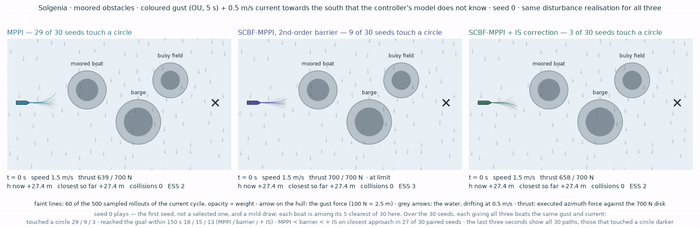
</p>

<p align="center"><sub>Three controllers under a coloured gust and a 0.5 m/s cross-current the controller
does not know about. At the end all 30 seeds of the experiment fade in behind the played one, with the
runs that touched a circle drawn darker, so the single run on screen is put in its context rather than
standing for the result. <code>python -m scbf_mppi.vessel.animate_current --ghosts</code></sub></p>

<p align="center">
  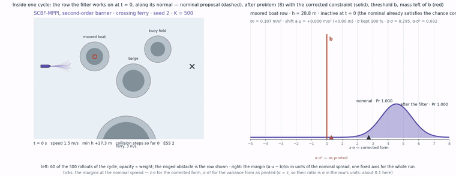
</p>

<p align="center"><sub>Inside one cycle. Left, the map with its sampled fan. Right, the distribution of
a&middot;u along the barrier row's own normal: the nominal proposal, the filtered one, the threshold, and the
two competing margins &mdash; z&middot;&sigma; as the derivation needs it, and &alpha;&middot;&sigma;&sup2; as the paper prints it. On the vessel
their ratio is about 0.1. <code>python -m scbf_mppi.vessel.animate_rowspace</code></sub></p>

### The same runs in three dimensions

Nothing here is new physics. The viewer replays the identical stored state logs; the model is planar, so
there is no roll, pitch or heave in it and none is drawn. What three dimensions add is two things a
top-down plot hides: the candidate paths the controller chose between, and the thrust it is spending
against its limit.

Path traced in Blender (Cycles), 1920 &times; 1080. **Click a still to play it.**

<table>
<tr>
<td width="33%" align="center">
  <a href="figures/anim3d_pathtraced_ferry_chase.mp4">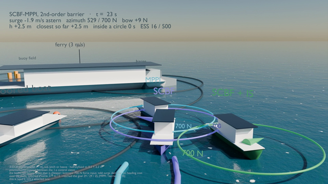</a><br>
  <sub><b>crossing ferry</b> &middot; 38 s &middot; 33 MB</sub>
</td>
<td width="33%" align="center">
  <a href="figures/anim3d_pathtraced_current_chase.mp4">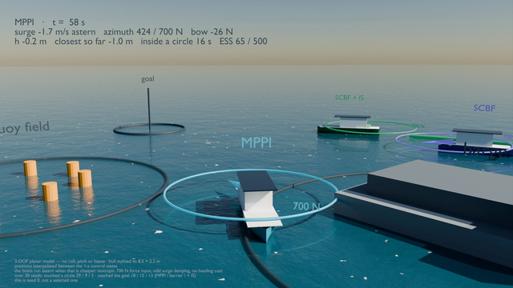</a><br>
  <sub><b>unknown current</b> &middot; 44 s &middot; 27 MB</sub>
</td>
<td width="33%" align="center">
  <a href="figures/anim3d_pathtraced_current_orbit.mp4">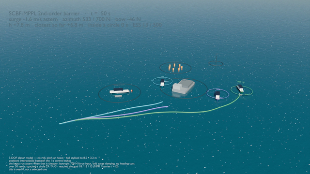</a><br>
  <sub><b>the same, from orbit</b> &middot; 45 s &middot; 23 MB</sub>
</td>
</tr>
</table>

Captured live from the offline viewer, 1600 &times; 900:

<table>
<tr>
<td width="25%" align="center">
  <a href="figures/anim3d_ferry_chase.mp4">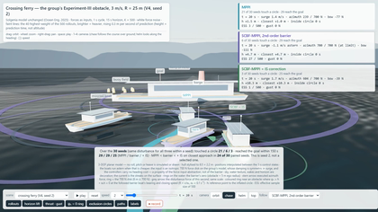</a><br>
  <sub>ferry, chase camera</sub>
</td>
<td width="25%" align="center">
  <a href="figures/anim3d_current_chase.mp4">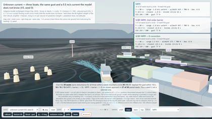</a><br>
  <sub>current, chase camera</sub>
</td>
<td width="25%" align="center">
  <a href="figures/anim3d_current_orbit.mp4">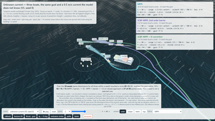</a><br>
  <sub>current, orbiting camera</sub>
</td>
<td width="25%" align="center">
  <a href="figures/anim3d_corridor_orbit.mp4">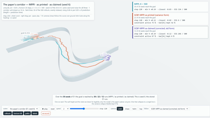</a><br>
  <sub>the corridor in 3-D</sub>
</td>
</tr>
</table>

`live_demo/3d/README_3D.md` gives the exact command behind every 3-D clip, including the frame ranges.

### One thing to notice before anyone points it out

In several clips the boats travel **astern**. That is a property of the abstraction, not a bug and not
the barrier: the input is an isotropic 700 N force, the damping is symmetric in surge, and the running
cost penalises the size of the speed rather than its sign, so nothing in the problem prefers forwards.

`scbf_mppi/vessel/ext/costs.py` adds a heading term and experiment V9 re-runs everything with it;
`results/vessel_V9_heading.json` holds the outcome, and it changes one conclusion in the crossing-ferry
scene. The planar model is *not* exactly invariant under reversing the boat: the worst mismatch over
random states is 0.449 m/s², and it is exact only when the boat is not turning. `test_why_astern` in
`scbf_mppi/vessel/ext/selftest_ext.py` measures both statements rather than asserting them.

<details>
<summary><b>Every clip, and the command that writes it</b></summary>

| file | what it shows | written by |
|---|---|---|
| `anim_mppi_vs_scbf.mp4` | the paper's corridor, MPPI against SCBF-MPPI | `python -m scbf_mppi.animate` |
| `anim_corridor_three.mp4` | the corridor with the printed and the corrected form side by side | `python -m scbf_mppi.animate --three` |
| `anim_vessel_mppi_vs_scbf.mp4` | the vessel meeting the crossing ferry | `python -m scbf_mppi.vessel.animate` |
| `anim_vessel_current.mp4` | three controllers under a gust and an unmodelled 0.5 m/s current | `python -m scbf_mppi.vessel.animate_current` |
| `anim_vessel_current_ghosts.mp4` | the same run with the rejected candidate paths drawn | `python -m scbf_mppi.vessel.animate_current --ghosts` |
| `anim_vessel_rowspace.mp4` | one control cycle opened up: the barrier rows and the chosen input | `python -m scbf_mppi.vessel.animate_rowspace` |
| `anim3d_corridor_orbit.mp4` | the corridor run in three dimensions | `live_demo/3d/capture_mp4.py` |
| `anim3d_ferry_chase.mp4` | the ferry crossing, camera behind the course over ground | `live_demo/3d/capture_mp4.py` |
| `anim3d_current_chase.mp4` | the current scene, same camera | `live_demo/3d/capture_mp4.py` |
| `anim3d_current_orbit.mp4` | the current scene, orbiting camera | `live_demo/3d/capture_mp4.py` |
| `anim3d_pathtraced_ferry_chase.mp4` | the ferry crossing, path traced at 1920 × 1080 | `live_demo/3d/blender_render.py` |
| `anim3d_pathtraced_current_chase.mp4` | the current scene, path traced | `live_demo/3d/blender_render.py` |
| `anim3d_pathtraced_current_orbit.mp4` | the current scene from orbit, path traced | `live_demo/3d/blender_render.py` |

Two render passes that were superseded are deliberately not in the repository: an earlier 1600 × 900
path-traced pair, and a larger encode of `anim3d_pathtraced_current_orbit.mp4` at the same resolution.
The animated GIF beside each 2-D clip is not tracked either, being a lower-resolution copy of the mp4.
The reduced animations on this page are in `media/`. All of them regenerate from the commands above.

</details>

`FINDINGS.md` states each result with the assumptions it needs, separates the standard mathematics
from what is new here, and lists the four claims made during this work that were later withdrawn.

## Reading the results honestly

Everything here is a reimplementation from the paper's text: where the paper is silent, the assumption is listed above and can be
changed on the command line. Two things are therefore *findings about the paper as written*, not about the authors' code:
that σ = I is incompatible with Table I, and that the constraint as printed delivers a lower probability than it claims.
Everything else — the wall-clock cost, the activation fraction, the collapse of the corrected constraint, the mechanism
separation — is a property of the method as specified, in the regime where its own baseline numbers reproduce.

## Beyond the reproduction: seven questions the critique opens (`scbf_mppi/vessel/ext/`, `tests/`)

The reproduction ends with a set of objections. These seven experiments turn the sharpest of them into
measurements. They are additions, not corrections: no shipped result file is touched, and
`tests/test_regression.py` re-runs twelve shipped configurations and requires bit-identical trajectories
after every change here.

```
python -m scbf_mppi.vessel.ext.selftest_ext                              # ~2 min, 21 checks
python -m scbf_mppi.vessel.ext.experiments_ext --exp all --runs 30       # writes results/vessel_V9..V12*.json
python -m scbf_mppi.vessel.ext.figures_ext                               # writes figures/fig_V9..V12*.png
```

**V9 — the heading term the cost does not have.** The vessel running cost is distance to the goal plus a
speed penalty on `|u|`, so nothing prefers bow-first motion, and every controller spends much of a run going
astern on an isotropic 700 N force disk. That is a property of the force-input abstraction rather than of the
barrier, and it affects all three controllers, but it invites the question whether the comparison survives a
cost that does prefer going forwards. V9 adds an optional heading term and an optional astern penalty and
re-runs the comparison in both scenarios, over a weight sweep.

**V10 — the barrier in the sampler or on the output.** The paper pushes the barrier into the sampling
distribution, at K × T = 7500 constrained solves per control cycle. The standard alternative is one convex
solve per cycle that projects the controller's output onto the same barrier condition. V10 runs both, plus a
chance-constrained filter whose tightening is derived exactly for a force disturbance, with the same MPPI, the
same barrier gains, the same seeds and the real input set (the 700 N azimuth cone and the speed-dependent bow
cap). It also shows what the paper's white-noise assumption costs: the tightening it demands is √(2τ_c/h) —
here a factor 3.2 — larger than the one a correlated gust of the same intensity demands.

**V11 — the disturbance the chance constraint never sees.** In the unknown-current scenario the controllers
are blind to a 0.5 m/s drift that enters the position kinematics, so their barrier derivative is wrong by
n · c, up to 0.5 m/s — the size of the whole α₁h term at h = 5 m. A nominal δ = 0.003 says nothing about
that: δ bounds the modelled noise, not an unmodelled drift. V11 adds a kinematic-residual observer (which
needs no vessel model, only the measured state), injects the estimate into the rollouts and into the barrier
rows separately, and audits at the plant how often the controller's own certificate was false.

**V12 — the effective sample size the correction destroys.** With the importance-sampling weights the paper
omits, the median effective sample size is 13 of 500. V12 retunes the temperature on line to hold the ESS at
a target, exploiting `log w(λ) = −J/λ − C + log q` so one rollout batch gives the whole family of weights.
It reports ESS together with the norm of the control update and the fraction of runs that reach the goal,
because ESS bought by flattening the weights is not a rescue.

**V14 — the deadline, which a median does not describe.** Everything above reports a median cycle time.
A controller that runs in a fixed interval is not judged on its average; it is judged on the cycle that
overruns, because that is the cycle where the vessel gets no new command and holds the previous one for
another second while a ferry closes at 3 m/s. `tests/timing_deadline.py` measures the whole per-cycle
distribution at the same matched operating point, 275 cycles per controller, and asks how many would have
missed a one-second interval.

```
python tests/timing_deadline.py          # ~20 min, writes results/vessel_V14_deadline_*.json
python tests/figure_deadline.py          # writes figures/fig_V14_deadline.png
```

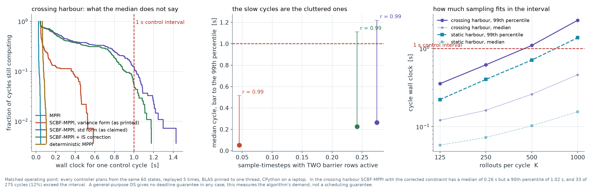

In the crossing harbour, with the corrected standard-deviation constraint and K = 500:

| | median | p90 | p99 | max | cycles over 1 s |
|---|---|---|---|---|---|
| MPPI | 0.026 s | 0.032 s | 0.044 s | 0.047 s | 0 of 275 |
| deterministic MPPI | 0.067 s | 0.077 s | 0.100 s | 0.108 s | 0 of 275 |
| SCBF-MPPI, variance form as printed | 0.052 s | 0.360 s | 0.515 s | 0.585 s | 0 of 275 |
| SCBF-MPPI + IS correction | 0.225 s | 0.898 s | 1.111 s | 1.177 s | **14 of 275** |
| SCBF-MPPI, std form as claimed | 0.263 s | 1.016 s | 1.219 s | 1.430 s | **33 of 275** |

The median says 0.26 s, a 74 % margin. The 90th percentile is already over the interval, and 12 % of cycles
miss it. Quoting the median for this method is not a small inaccuracy; it inverts the answer.

**Why the tail exists, measured rather than asserted.** The correlation between a cycle's wall clock and the
fraction of its sample-timesteps with *two* barrier rows active at once is **r = 0.99**. Two active rows are
where the per-sample problem leaves its closed form and enters a candidate search with LP vertex
enumeration. So the slow cycles are the cluttered ones, and the controller is slowest exactly where the
scene is most dangerous. In the static harbour, where two rows bind on 17.7 % of sample-timesteps instead of
27.5 %, nothing misses at all.

**The connection to the main criticism.** The variance form the paper prints is five times cheaper at the
median than the standard-deviation form its own derivation needs, and it never misses the interval. It is
cheap for the same reason it is wrong: its margin is smaller by a factor σ, so it binds on 4.5 % of
sample-timesteps instead of 27.5 % and mostly leaves the closed form alone. Correcting the constraint to
what Theorem 2 actually requires raises the delivered probability on this vessel row from 0.952 to
0.997, and from 0.916 to 0.997 in the corridor, **and** turns a controller that always meets its
deadline into one that misses 12 % of them. That is the real price of the correction, and it is not
visible in any average.

**What fits.** Sweeping the sample count, the largest K whose 99th percentile still fits one second is
**250 in the crossing harbour and 500 in the static one**. Real time therefore costs a halving of K in the
cluttered scene, which is the parameter the method's performance depends on most.

Honest limits, which belong beside every number above. This is CPython on a laptop with BLAS pinned to one
thread, chosen so the figures are comparable with the shipped ones; it is not an estimate of optimised code
on the vessel's computer. And a general-purpose operating system offers no deadline guarantee in any case,
so what is measured is the algorithm's demand, not a scheduling guarantee.

**V15 — the weights the method omits, and why they cannot simply be restored.** Algorithm 1 reshapes the
sampling distribution per sample and per timestep and then uses MPPI's cost-weighted average unchanged.
That average is a path-integral estimator only if the samples are reweighted by the density ratio between
the law actually sampled and the one the derivation assumes. The paper does not mention the reweighting;
it notes after (11) only that the update "cannot guarantee the optimality anymore" and is "more
conservative", without proof.

It is not conservatism. For one active row, with the objective of (8) and the corrected constraint, the
cost as a function of the retained row standard deviation has slope `z/‖a‖∞ − 1/‖a‖₂` on the binding
branch, which is positive whenever

```math
z \;>\; \frac{\lVert a\rVert_\infty}{\lVert a\rVert_2}
```

Since `‖a‖∞/‖a‖₂ ≤ 1` always, every δ ≤ 0.1587 satisfies it, so the optimum is `s* = max(0, slack/z)` and
is **exactly zero whenever the nominal mean already violates the row**. The proposal is then mutually
singular with the base measure: the free-energy identity MPPI is derived from needs absolute continuity
and does not hold, the weight `dp/dq` does not exist, and any implementation must invent a regulariser
whose constant then decides the closed-loop result. Verified against the exact conic solve at the
predicted threshold; measured at 13.0 % of samples at t = 0 in the corridor with the corrected form and
0.0 % with the printed one. *Stated with its assumptions: single active row, unconstrained mean, and a
Frobenius or spectral norm on the covariance factor. Non-singular feasible proposals still exist if the
mean moves further into the safe region; the obstruction is the objective's preferred solution.*

```
python tests/gpu_ess_scaling.py      # needs CUDA; CPU/GPU gate, then the sweep in K
```

Pushed to a million samples at warm operating points, plain MPPI's asymptotic effective sample size tracks
the budget while the corrected estimator's does not move at all:

| rollouts K | plain MPPI | Algorithm 1 as printed | with the weights restored |
|---|---|---|---|
| 500 | 125 | 1.7 | 1.00 |
| 1,000,000 | 212,326 | 50.3 | 1.00 |

Two cautions on how to read that, both of which cost an earlier version of this work its conclusion.
`ESS/K → 1/(1+χ²)` is an **asymptotic** efficiency and not a cap on a finite run: for a proposal attaining
the bound, no sample lands in the violation set in (1−δ)^K = 0.997^500 = 22.3 % of runs at K = 500,
δ = 0.003, and the measured value is then exactly 500. And this is the **corridor**. On the vessel the collapse is not caused by the
density correction at all — decomposed per cycle, the median effective size from the cost softmax alone is
3.3, from the weights alone 157.4, and from both 3.1, so there it is the λ = 300 temperature against a
20,000 m² penalty. The two systems behave differently and neither result transfers to the other.

**V16 — where the advantage actually comes from, and a dial that spans it.** Restoring the weights gives
the best controller measured here. Over 512 corridor seeds at the repository's own settings:

| controller | reached | median collision | median min h | ever unsafe | runaway | ESS |
|---|---|---|---|---|---|---|
| plain MPPI | 97.5 % | 0.0461 | −0.051 | 95.1 % | 0 / 512 | 160.1 |
| Algorithm 1, as printed | 76.8 % | 0.0240 | −0.045 | 72.3 % | 5 / 512 | 240.3 |
| Algorithm 1, corrected constraint | 35.2 % | 0.0400 | −0.086 | 84.8 % | 16 / 512 | 280.1 |
| corrected **+ the omitted weights** | 100.0 % | 0.0000 | **+0.167** | **12.1 %** | 0 / 512 | **1.9** |
| intervention penalty, μ = 0.5 | 99.4 % | 0.0000 | +0.133 | 16.8 % | 3 / 512 | **69.4** |

Every column above is a **median** except *reached*, *ever unsafe* and *runaway*, and that is deliberate:
the mean minimum barrier is useless here. A handful of runaway episodes drag it to −855 for Algorithm 1 as
printed and −442 for the corrected form, so a mean ranks the controllers by how badly their worst episodes
fail rather than by what they typically do. Reading means cost this work one wrong conclusion before the
medians and the explicit tail counts replaced them.

An effective sample size of two is not averaging. It is selection, and the dominant term in the log
density ratio is `log s`, so the rollout it selects is the one the barrier had to correct least over the
whole horizon. Charging for that explicitly turns the accident into a parameter. Let `I = |m| + (σ₀ − s)`
be the per-sample problem's own objective value, which the paper computes at every sample and discards:

```math
w_k \;\propto\; \exp\!\left(-\frac{S_k + \mu\lambda\sum_t I_{k,t}}{\lambda}\right)
```

`μ = 0` reproduces the corrected controller to the digit, large `μ` reproduces the accidental rule, and
every value between is a valid estimator, because `I` is a deterministic function of the solve rather than
of the noise. The systematic part of the omitted correction is the useful safety preference; the noise
part is what destroys the sample size.

**What this does not establish.** The intervention penalty is not demonstrated to be a better controller.
Its runaway-episode rate of 3 of 512 cannot be distinguished from zero by Fisher's exact test (p = 0.249),
but it is not monotone in μ: across μ = 0, 0.1, 0.2, 0.3, 0.5, 1 and 3 the runaway counts are
16, 13, 7, 9, 3, 8, 1 of 512, so the tail is unresolved at this seed
count, and a safety argument rests on the tail. Separately, the budgeted per-sample problem in
`scbf_mppi/ess_budget.py` does exactly what it was built to do — the weight budget binds to machine precision (2·10⁻¹⁶ across the 113 admissible β)
and the effective size rises from 1.9 to 33.7 — and buys no control benefit, landing on plain MPPI. (Its
10 % target bounds the **density-ratio factor** alone; the realised episode mean multiplies that by the cost
softmax, which is itself only 160.1 of 500 for plain MPPI, so 33.7 is the product and not a missed target.)
That is
the finding rather than a disappointment: restoring the estimator removes the advantage, which is what
identifies selection rather than averaging as the mechanism.

```
python tests/gpu_closed_loop.py --seeds 512    # needs CUDA; the table above
```

**V17 — a sharper obstruction, and both it and the μ dial made interactive.** Section V15 says the
*optimiser* collapses the covariance. At the corridor's own start state a stronger statement holds, and it
depends on nothing that an implementation is free to choose — not the objective, not the mean, not the
norm on the factor, not correlations with the turn-rate channel.

The corridor's two walls constrain the **same** forward-speed variable from opposite sides. Meeting both
corrected chance constraints requires `ℓ + zσ ≤ μ ≤ r − zσ`, so a Gaussian exists only for
`σ ≤ (r − ℓ)/2z`. Finite variance of the exact importance weight requires `σ > σ₀/√2`. A usable Gaussian
therefore exists **exactly when**

```math
r - \ell \;>\; \sqrt{2}\,z\,\sigma_0
```

At `x = 0, y = 0.5, θ = 0` with `σ₀ = 1` and `δ = 0.003`, evaluated against this repository's own
`Corridor.scbf_rows`:

| | |
|---|---|
| largest σ both walls allow | 0.115843 |
| smallest σ giving finite weight variance | 0.707107 |
| the test | 0.636620 > 3.885950 — **fails by a factor of six** |

So at that state every non-degenerate Gaussian first-speed proposal satisfying both corrected wall
constraints has infinite exact importance-weight variance. Carried to the full cost-weighted target,
divergence holds whenever `σ² < (2/σ₀² + 4(T+1)Δt²/λ)⁻¹`, which is 0.452489 here, and every chance-feasible
Gaussian is capped at 0.013420 — well inside it. The MPPI cost does not rescue the example. *The
construction and the full-target extension are due to an external review of commit `33497d1`, not to this
repository; they are recorded because they were verified here to the digit and because they subsume V15's
statement. Infinite variance does not mean a particular finite run fails, and a singular proposal escapes
it only by losing the support that exact correction needs.*

**Both results are now instruments in the live demo rather than paragraphs.** The demo gained:

* **“Can any Gaussian do this?”** — the test above, evaluated live at whatever state the plan starts from.
  Two bands on a σ axis: what the two walls allow, and where the importance weight has finite variance.
  At the start state they do not touch, and the panel prints the factor. It is not rigged to fail: where the corridor runs
  straight the coefficient `a` is small, `r − ℓ = (h₁+h₂)/|a|` opens up, and the verdict chip flips to
  green — which is the honest statement, since the obstruction is a property of the state and not of the
  method everywhere.
* **A μ slider** on a new controller, *SCBF-MPPI + intervention penalty*. Moving it sweeps continuously
  from the corrected controller to the selection rule Algorithm 1 reaches by accident, and the effective
  sample size on the right-hand panel moves with it, live.
* **An ESS-budget controller** with a target-fraction slider, *SCBF-MPPI + ESS budget*. It solves the
  per-sample problem subject to the budget of `scbf_mppi/ess_budget.py` — the mean shift is capped at
  `|m| ≤ σ₀√((2β²−1)·log(κ√(2β²−1)/β²))` at each covariance shrink `β`, inadmissible where that logarithm's
  argument falls to 1 or below — so the weight second moment is held at `κ` per step by construction. It is
  the only filtered controller here whose importance weights are **always** applied, because the budget is
  what makes them exist: Algorithm 1's optimum collapses the covariance and the weight then has no density
  to evaluate. Moving the slider from 5 % to 50 % raises the effective sample size monotonically while the
  controller stays on plain MPPI's behaviour, which is the finding rather than a disappointment — restoring
  the estimator removes the advantage, and that is what identifies selection rather than averaging as the
  mechanism. Cross-checked by `node live_demo/xval_budget.js` (`xval_budget.log`): the browser's 97-point
  β grid against the package's 193-point one, at the 10 % target, lands on the 512-seed GPU figure.
* **"Why the restored weights select"**, the log density ratio split live into its three parts — the mean
  shift, the noise, and the shrink `Σ_t log s` — compared by their spread *across* the K samples, since only
  that can select. It carries its own arithmetic check: for plain MPPI `m = 0` and `s = σ₀` at every sample,
  so the three parts cancel and the panel reports a total spread of **exactly zero**. Switch to the restored
  weights and the shrink term takes essentially the whole spread — 57.6 of 57.4, correlated at **0.999** —
  which is the mechanism of V16 made visible: an effective size near one picks the rollout the barrier
  corrected least. Two contrasts come free. The **printed variance form** shows a shrink spread of only 7.7,
  because its optimum never collapses the covariance; and the **ESS budget** flattens it to 0.459, which is
  precisely what holding `E_q[w²]` at κ per step buys. `node live_demo/xval_logsplit.js`
  (`xval_logsplit.log`) records all five, beside the Python figures from
  `tests/logratio_decomposition.py`.

### Three measurements the external reviews prompted

Each answers a question this repository had raised and then left open, and each ships the script that
produces it. The first two are also live panels in the demo, cross-checked against the Python by
`node live_demo/xval_certificate.js` and `node live_demo/xval_mixture.js` (the mixture panel's per-row
violation rate agrees to `4.6e-5`, its coverage to 0.038 and its RMSE to 0.078).

* **How much of a barrier-row violation is an actual collision?** `sat_active` counts violations of the
  row; `collision_rate` counts leaving the safe set; nothing here had ever related the two, so "the
  sampler violated the row 8 % of the time" carried no safety meaning. Under plain MPPI the certificate is
  **sound** and imprecise — `Pr(leaves the safe set | M = 0) = 0.000545`, `Pr(leaves | M ≥ 1) = 0.2779`, so
  three quarters of what the barrier refuses would have been fine. Under the **filter's own** trajectories
  the conditional **inverts**: 0.0605 against 0.0273, because the filter steers onto the boundary where the
  row holds by construction and a continuous-time condition at discrete steps on a curved wall does not
  give discrete invariance. Soundness is a property of the certificate *and* the distribution it is scored
  on. FINDINGS.md §4b. `python tests/certificate_conservatism.py --seeds 64 --kind mppi`
* **Does the mixture that escapes §2b's obstruction actually estimate anything?** No. At an admissible
  mixing weight the class the safe proposal could not reach reappears in **54 %** of batches, and the
  estimate stays at `0.060` against a true `0.494`, with the RMSE **worse** — `0.85` against `0.55`.
  Support returns; accuracy does not. `python tests/mixture_recovery.py`
* **What does the sample-efficient safe Gaussian choose in flight?** The `β* = 1.63 … 4.28` table in §2 is
  evaluated at four chosen slack values and shipped no solver. Solved at the states Algorithm 1 actually
  visits — 160 million sample-timesteps — it wants a mean `β` of **1.15**, against the **0.12** mean
  `s/σ₀` that (8) returns. The widening is real at tight slack and largely absent in flight; what
  separates the two programs on a real trajectory is the collapse.
  `python tests/renyi_safe_gaussian.py --closed-loop`

`live_demo/xval_obstruction.js` checks the panel against this section: run at the default start state it
reproduces every figure in the table above — the interval `[-1/π, 1/π]`, the cap, the floor, the
full-target threshold and the factor of six — to 5·10⁻⁷, reading the rows from the browser core rather
than from the Python package (`xval_obstruction.log`). `live_demo/xval_intervention.js` cross-checks the
browser controller against the study, and is the check that matters for it: at μ = 0 it reproduces the corrected controller **to machine precision**, so the
penalty is not leaking into the baseline, and over 24 seeds the effective sample size falls monotonically
280.2 → 258.8 → 197.8 → 143.0 → 68.1 → 6.8 → 2.4 across μ = 0 … 3 while the median minimum barrier rises
from −0.074 to +0.189. `live_demo/xval_intervention.log` is that run.

**Two defects in this repository, both found from outside it, both fixed.** A transpose in
`vessel/solver_nd.py` reported `‖P a‖` where the sampling covariance needs `‖Pᵀa‖`; the regression guard
then proved the damage was confined to one diagnostic field, and an intermediate claim of mine that it
also sat on the sampling path was wrong. And the GPU closed-loop harness averaged the effective sample
size over cycles in which a finished seed's planner was still running at the goal, inflating the column by
1.68× for plain MPPI and by *different* factors for different controllers. Both are written up in
`FINDINGS.md` §5b and §5c, with what they cost and what caught them.

**On novelty, checked rather than assumed.** Every claim above was put to a four-way prior-art search —
academic index, citation graph, open web, and implementations — with the searchers told to *refute*. Each
citation it returned was then read directly and the condition verified in the source. The result is that
**nothing here is a new theorem**, and one claim is prior art outright: charging a safety filter's own
effort as an extra λ-scaled running cost in the MPPI exponent is Gandhi, Almubarak, Aoyama and Theodorou,
arXiv:2204.05963 (2022), Algorithm 1, and Robust MPPI before it, and the reason it is valid at all is
Section III-B of MPPI's own founding paper, *Likelihood Ratio as Additional Running Cost*
(arXiv:1509.01149). The two-sided chance-constraint cap is Lubin, Bienstock and Vielma
(arXiv:1507.01995, Lemma 16); the finite-variance floor is textbook; the χ² bound is
Hammersley–Chapman–Robbins with an indicator test function, which Polyanskiy and Wu set as a reader
exercise. What survives is composition and measurement: **where** the optimum of this paper's own
per-sample program lies, that the covariance its barrier shrinks **is** the proposal covariance, and what
both cost when measured. Three equations came back from that search with nothing stated anywhere else —
`s* = clip((a·ū − b)/z, 0, ‖P₀ᵀa‖)`, the optimum of the paper's own (8); `z > ‖a‖∞/‖a‖₂`, when that optimum
is zero; and `r − ℓ > √2·z·σ₀`, when any usable Gaussian exists — and `FINDINGS.md` §7 lists them with the
qualifier they need, *not found stated anywhere, and I looked*, which is not the same as new. §7 also states
each prior-art position with its citation, and §5b–§5d record the two defects found in this repository and
the setting that must be quoted with the V15 table.

### Every equation this work uses, and where each one comes from

Collected in one place because the sections above introduce each where it is needed, and because the only
question that matters for any of them is *whose is it*. Nothing here is a new theorem.

**The correction.** The paper's Theorem 2 / eq. (6) is reached by taking "the upper bound of the confidence
interval for the Gaussian variable", and a Gaussian confidence interval is built on the standard deviation:

```math
\underbrace{a^\top\mu - z\,(a^\top\Sigma a) \;\ge\; b}_{\text{as printed}}
\qquad\longrightarrow\qquad
\underbrace{a^\top\mu - z\sqrt{a^\top\Sigma a} \;\ge\; b}_{\text{as the proof requires}},
\qquad z=\Phi^{-1}(1-\delta)
```

Not new — it is the textbook chance constraint, and merely the one the paper should have printed. At
$\delta = 0.003$, $\sigma = 0.5$ and a mean of $z\sigma^2 = 0.686945$ the printed form is satisfied with
equality while the true violation probability is **8.47 %**, not the claimed 0.3 %.

**The three that no search found stated anywhere else.** Each is absent from Tao et al. *and* was not found
in any other source by a four-way prior-art search. None is a theorem — in order, three lines of convex
analysis, a slope comparison, and one line of arithmetic over two published inequalities:

```math
s^\star \;=\; \mathrm{clip}\!\left(\frac{a\cdot\bar u - b}{z},\; 0,\; \lVert P_0^\top a\rVert\right)
\qquad\text{the optimum of the paper's own (8), which it never locates}
```

```math
z \;>\; \frac{\lVert a\rVert_\infty}{\lVert a\rVert_2}
\qquad\text{exactly when that optimum is zero}
```

```math
r - \ell \;>\; \sqrt{2}\,z\,\sigma_0
\qquad\text{exactly when any usable Gaussian exists at that state}
```

Their honest status is **"not found stated anywhere, and I looked"** — four independent searches returning
nothing is not proof that nothing exists.

**Classical, and cited as such.** Used here, and nobody's contribution in this repository:

```math
\mathbb{E}_q[w^2] \;=\; \frac{\beta^2}{\sqrt{2\beta^2-1}}\;
\exp\!\left(\frac{m^2}{\sigma_0^2\,(2\beta^2-1)}\right),\qquad s=\beta\sigma_0
```

```math
\mathbb{E}_q[w^2]<\infty
\iff s > \frac{\sigma_0}{\sqrt{2}}\ \ \text{(scalar)}
\iff 2\Sigma_q - \Sigma_p \succ 0\ \ \text{(general)}
```

```math
\chi^2(p\,\|\,q) \;\ge\; \frac{(\delta_0-\delta)_+^2}{\delta(1-\delta)},
\qquad
\frac{\mathrm{ESS}}{K} \;\longrightarrow\; \frac{1}{1+\chi^2},
\qquad
\Pr(\text{all }K\text{ safe}) \;\ge\; (1-\delta)^K
```

The Gaussian weight moment is Owen ch. 9; the matrix condition is Pitt, Tran, Scharth and Kohn,
Proposition 1; the $\chi^2$ bound is Hammersley–Chapman–Robbins with the indicator of the violation set as
test function, which Polyanskiy and Wu set as a reader **exercise**; $\mathrm{ESS}/K \to 1/(1+\chi^2)$ is
Kong 1992. The two-sided cap behind $r-\ell > \sqrt{2}z\sigma_0$ is Lubin, Bienstock and Vielma, Lemma 16.


Every effective sample size in this document is the **full cost-weighted** one, $1/\sum_k w_k^2$ over the
realised weights — the cost softmax and, where a controller applies it, the density ratio. It is not the
density-ratio factor alone, which is what the $\chi^2$ bound above and the budget below actually govern. On
the vessel the two are far apart: cost softmax alone 3.3, weights alone 157.4, both 3.1. A measured value
can therefore sit below the bound without contradicting it.

And the obstruction above belongs to the **Gaussian family**, not to safe sampling as such. A defensive
mixture $q = wp + (1-w)q_1$ gives $\mathbb{E}_q[(dp/dq)^2] \le 1/w$ for any $w>0$ (Hesterberg 1995), so the
variance is finite. But the chance constraint caps $w \le \delta/\delta_0 = 0.003999$ here, bounding the
second moment above by 250.08 while the $\chi^2$ floor bounds it below by 187.69. The mixture converts an
infinity into a number between 188 and 250 — it escapes the obstruction and pays the bound instead.

**Prior art — and the one that most looked new.** Charging a safety filter's own effort as an extra
$\lambda$-scaled running cost inside the MPPI exponent:

```math
w_k \;\propto\; \exp\!\left(-\frac{S_k + \mu\lambda\sum_t I_{k,t}}{\lambda}\right),
\qquad I \;=\; |m| + (\sigma_0 - s)
```

This is **not** in Tao et al., which is exactly what made it look new — but it is Gandhi, Almubarak, Aoyama
and Theodorou (arXiv:2204.05963) Algorithm 1, and Robust MPPI a year earlier, and the reason it is a valid
estimator at all is §III-B of MPPI's founding paper, *Likelihood Ratio as Additional Running Cost*
(arXiv:1509.01149). *Not in the paper under review* and *new* are different things.

**From the external reviews, verified here.** The full cost-weighted extension of the obstruction, and the
split of the log density ratio that identifies the mechanism of V16:

```math
\sigma^2 < \left(\frac{2}{\sigma_0^2} + \frac{4(T+1)\Delta t^2}{\lambda}\right)^{-1}
\;\Longrightarrow\; \mathbb{E}_Q[W^2] = \infty
\qquad (=0.452489\ \text{here; every feasible } \sigma^2 \le 0.013420)
```

```math
\log\frac{p}{q}
= \underbrace{\sum_t\left[-\tfrac12\left(\tfrac{m+s\xi}{\sigma_0}\right)^{2} - \log\sigma_0\right]}_{\text{mean shift}}
+ \underbrace{\sum_t \tfrac12\,\xi^2}_{\text{noise}}
+ \underbrace{\sum_t \log s}_{\text{shrink}}
```

Measured across samples, the shrink term's spread is **44.65** against 2.49 and 3.10 for the other two, and
the total correlates with it at **+0.994** — the selection is the shrink.

**The one constructive equation, and the only one whose status is still open.**
`scbf_mppi/ess_budget.py` inverts the weight second moment into an admissibility budget on the mean shift,
then chains it over the horizon:

```math
|m| \;\le\; \sigma_0\sqrt{\,(2\beta^2-1)\,\log\!\left(\frac{\kappa\sqrt{2\beta^2-1}}{\beta^2}\right)},
\qquad
\frac{\mathrm{ESS}}{K} \;\ge\; \kappa^{-T},
\qquad
\kappa = \rho^{-1/T}
```

with the proposal inadmissible wherever the logarithm's argument falls to 1 or below. It binds to machine
precision, $2\cdot10^{-16}$ across the 113 admissible $\beta$, and buys no control benefit.

A prior-art search found **the closed-form bound itself stated nowhere**, and it is the only equation here
of which that is true — but it needs three concessions, each of which a well-read examiner will raise.
*The expression being inverted is published repeatedly and independently*: it is the exponentiated
Rényi-2 divergence between two Gaussians, Metelli, Papini, Faccio and Restelli (POIS, NeurIPS 2018)
Appendix C eq. (14) at $\alpha=2$, equivalently Sanz-Alonso and Wang Proposition 2.4 — and the inversion is
one line of algebra. *The same inversion is published in a different divergence*: Otto et al. (ICLR 2021)
invert a closed-form Gaussian divergence into an explicit mean-shift ball and enforce it as a hard
projection, for KL, Wasserstein-2 and Frobenius. *And at $\beta = 1$ it collapses* to
$|m| \le \sigma_0\sqrt{\log\kappa}$, the one-line inversion of the classical exponential-tilting identity —
verified here to be exact. The ESS link $\mathrm{ESS} = N/d_2$ is POIS eq. (6) and Kong 1992, and the
per-step-to-horizon chaining is POIS Proposition E.1.

What survives is narrow and should be said narrowly: the inversion itself with its companion feasibility
test (no mean shift admissible once $\kappa \le \beta^2/\sqrt{2\beta^2-1}$); the fact that the
$2\beta^2-1$ factor **couples** mean shift and covariance shrink into one feasible region rather than two
separate budgets; and its use as a hard per-sample constraint inside a chance-constrained sampling-based
MPC safety filter, so the sample size cannot collapse by construction — the MPPI safety-filter family
bounds neither the weight second moment nor the effective sample size at all. All three arithmetic claims
were checked here: the $\beta=1$ collapse is exact, the feasibility threshold returns NaN just below and a
positive budget just above, and substituting the bound back into $\mathbb{E}_q[w^2]$ returns $\kappa$ to
$1.8\cdot10^{-15}$. `FINDINGS.md` §7 states the position with its citations.

### What the two external reviews corrected, and what survived

Two outside reviews were checked against this repository line by line — a six-point technical review of the
theory, and a research brief on the corridor. Every correction below was verified here before being
accepted; the ones that were wrong are said to be wrong, and there were none in the first review.

**1. The χ² bound needs a positive part.** `χ²(p‖q) ≥ (δ₀−δ)₊²/(δ(1−δ))`, because without it `δ < δ₀` fails:
`q = p` then satisfies the constraint at zero divergence. Correct, and the bound is sharp — attained by
keeping the reference conditionals and moving the mass. Carried in `FINDINGS.md` §3.

**2. The effective sample size is a population quantity, not a finite-run ceiling.** `ESS/K → 1/(1+χ²)` is
asymptotic. For the equality-attaining proposal at K = 500, δ = 0.003, no sample lands in the violation set
in `(1−δ)^K = 0.997⁵⁰⁰ = 22.3 %` of runs, and the measured ESS is then exactly 500 — an estimator that has
missed the region entirely, reporting perfect health. *This repository previously carried 21.5 % from a
finite simulation where the closed form was available.* The review also notes that `δ₀ = 0.5` requires the
nominal projected mean to sit exactly on the boundary, `a·μ₀ = b`; a physical state on the barrier does not
imply it. Both correct.

**3. The governing divergence is against the target, not the nominal law.** MPPI estimates under
`π ∝ exp(−S/λ)·p`, so the relevant quantity is `χ²(π‖q)` and `δ₀` must be replaced by `π(A)`. If the running
cost already suppresses the unsafe set below δ, the chance constraint forces no divergence at all.
The bound therefore limits *recovery of the nominal law* and is not an impossibility result for every safe
MPPI variant. Correct, and it is the single most important limit on how far the §3 result reaches.

**4. `(1−δ)^K` is a conservative guarantee, not a ceiling.** It lower-bounds the probability that *every*
sample is safe; and since a convex combination of inputs each satisfying the same linear row also satisfies
it, it lower-bounds the probability that the executed average is safe. It does not bound the executed
input's safety from above — the average can satisfy the row while individual samples violate it, which is
what this repository measures: the averaged input never violated the row in 666 active instances.
Tightening per sample by the union bound, `δ/K`, is *sufficient* for all-samples-safe at level `1−δ` and
needs `z′ = 4.378` here; it is not necessary for safe execution. Correct, and it had no trace here until it
was checked.

**5. State the covariance-collapse result with its assumptions.** Single active row, unconstrained mean, and
a Frobenius or spectral norm on the covariance factor; non-singular feasible proposals still exist if the
mean moves further into the safe region, so the obstruction is the objective's preferred solution rather
than infeasibility. And `σ₀/√2` is the **scalar** case — a geometric fraction of a specified activation
band, not a universal fraction of Gaussian proposals or of observed timesteps. The general condition is the
matrix one, `2Σ_q − Σ_p ≻ 0`. All correct, and carried in §2 and §3.

**6. Keep the experimental and novelty claims provisional.** Acted on rather than argued with: the slope
extrapolation it warned about is gone from this repository, and novelty is now answered with citations
rather than assertion (§7 of `FINDINGS.md`).

**The research brief.** Its corridor obstruction and the full cost-weighted extension were reproduced here
to the digit against this repository's own `Corridor.scbf_rows`, and are §2b. Its bug report against
`vessel/solver_nd.py` was correct and is fixed (§5b) — and its severity assessment was right where this
work's was wrong. Its plain-MPPI effective sample size of 170.62 over 30 seeds turned out to be the
consistent one: this work's 269.62 was the harness defect of §5c.

Its **constructive** contribution — a three-region sampler that keeps the nominal Gaussian's conditional
shape inside and outside the admissible interval while reallocating the three probabilities — **is the
reviewer's work, not this repository's**, and it is not reproduced here; its reported 30-seed comparison
(ESS 1.90 → 5.79) could not be checked without its prototype. It also sits in a known tradition, which the
brief says itself and which was verified here: Pitt, Tran, Scharth and Kohn (arXiv:1307.7975) give the
finite-moment condition **and** develop a two-component mixture proposal in §3.1 precisely to impose it, and
Patrick and Bakolas (arXiv:2403.18066) eq. (24) put a truncated Gaussian — positive piecewise reweighting —
inside MPPI, proved valid because it stays strictly positive wherever the base density is non-zero.

## Reproducing it

```
python reproduce.py            # environment, self-tests, bit-exactness guard   (~3 min)
python reproduce.py --full     # the above, then every experiment and figure    (~90 min)
python tests/drift_report.py   # how far the numbers moved when the versions moved
```

`REPRODUCIBILITY.md` states precisely what reproduces and what does not, and which reported numbers
are fragile across library versions. `requirements.txt` is pinned; `results_shipped_2026_09_12/` keeps the
result files the reported numbers were taken from, so the claim that the text matches the code stays checkable.
